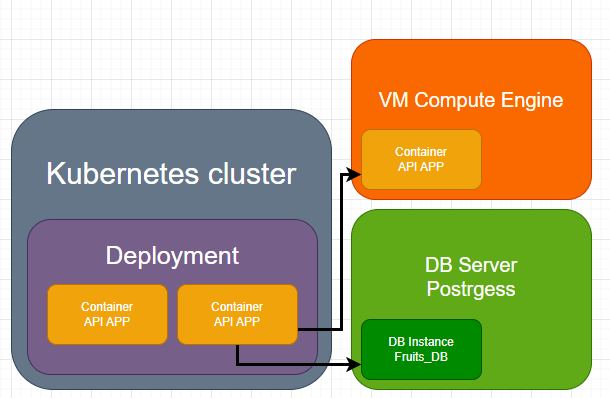

# GKE Lab – End-to-End CI/CD Pipeline with Jenkins, Kubernetes, Terraform, Docker & GKE

## Overview

This lab project demonstrates a full-stack, multi-repository CI/CD pipeline deploying a Node.js API application to a Google Kubernetes Engine (GKE) cluster, as well as a traidtional single-instance compute engine, It integrates infrastructure provisioning via **Terraform**, continuous delivery with **Jenkins**, Docker images pushed to **Docker Hub**, and secure access to secrets using **Google Secret Manager** combined with **Jenkins Secrets Manager**.

The project is split into three key repositories:

- Node.js Api-App Repository
- Terraform Infrastructure Repository
- Kubernetes Deployment Repository

---

## Components

### 1. Node.js Application Repository

**Description:**  
This repository contains the source code for a dummy REST API along with a Jenkins pipeline that handles testing, containerization, and deployment to Docker Hub. The application supports storing a simple string value and responds to basic GET and PUT requests. Future development plans include:

- Integrating logging and monitoring tools like Prometheus

- Enabling inter-instance communication

- Connecting to databases to persist and synchronize the stored value across deployments

**Challenges Addressed:**
One of the key challenges in this setup is managing proper permission configurations for the Jenkins agent and ensuring reliable socket sharing between Docker containers, especially in a local development or CI environment as well as permission for specific commands.

**Tech Stack:**  
- Node.js
- Docker
- Jenkins

**CI/CD Pipeline Tasks:**
- Install Node.js dependencies
- Run test script (`test.sh`)
- Build Docker image using `package.json` version
- Tag version and push to Docker Hub as `latest` and versioned
- SCM polling every 5 minutes

**Links:**  
- [final docker image](https://hub.docker.com/r/radeczu/apitestapp)
- [project repository](https://github.com/RadCzu/DevOpsTestNode) ← **Jenkinsfile is here!**

---

### 2. Terraform Infrastructure Repository

**Description:**  
Provisions the necessary GCP resources for the lab project with this terraform structure:

> ```
> /terraform  
> ├── main.tf              # Root configuration – defines provider and instantiates modules  
> ├── variables.tf         # Input variables used by main.tf and passed to modules  
> ├── Jenkinsfile          # Jenkins pipeline for automated provisioning  
> ├── set_env.ps1          # Optional local environment setup script that works with an .env file
> │  
> ├── /modules             # Directory of reusable, decoupled infrastructure components  
> │   ├── <module-name>/  
> │   │   ├── main.tf          # Core logic for the infrastructure resource  
> │   │   ├── variables.tf     # Module-specific inputs  
> │   │   └── outputs.tf       # Outputs exposed to root or other modules  
> │   ├── ...  
> ```  
>  
> Each module is fully self-contained and defines its own inputs, outputs, and logic, making them composable and independently testable.  

**Infrastructure diagram:**


**Tech Stack:**  
- Terraform
- Google Cloud SDK
- Jenkins
- Google Secret Manager
- Docker

**CI/CD Pipeline Tasks:**
- Jenkins agent authenticates to GKE Secret Manager using a GCP service account
- Fetch secrets securely from the Secret Manager into an `.env` file
- Export secrets into the environment locally from `.env`
- Impersonate the terraform GKE service account
- Run full Terraform workflow:
  - `init`
  - `validate`
  - `plan`
  - `apply`
- Generate impersonation token for Terraform provider

**Secrets Fetched:**
- DockerHub credentials
- GitHub PAT
- DB root password
- Terraform service account email, to impersonate this specific account when executing terrafform commands

**Links:**  
- [project repository](https://github.com/RadCzu/gcloud-lab-terraform)

---

### 3. Kubernetes Deployment Repository

**Description:**  
Deploys the Docker image to the GKE cluster using Helm.

**Tech Stack:**  
- Kubernetes (GKE)
- Helm
- Jenkins
- Google Cloud SDK

**CI/CD Pipeline Tasks:**
- Authenticate to GCP and fetch GKE credentials
- Pull Helm chart from `./k8s-api-app`
- Deploy application to GKE
- Use secret-managed service account for secure access

---

## Infrastructure Requirements

- GCP Project with:
  - GKE API enabled
  - Secret Manager API enabled
  - Service accounts with required IAM roles
- Docker Hub account (for image hosting)
- Jenkins instance with Docker host access
- Credentials stored in Jenkins:
  - `dockerhub-credentials`
  - `gcloud-sa-key`

---

## 🧪 Jenkins Setup

Each pipeline uses a Docker-based agent:

- **Node.js App:** `radeczu/node-with-jq`
- **Terraform:** `radeczu/node-with-jq:terraform`
- **Kubernetes:** `radeczu/gcloud-sdk`

For a simmilar setup to work make sure Jenkins has:
- Docker host mounted (`DOCKER_HOST=tcp://host.docker.internal:2375`)
- Proper credentials configured
- SCM polling enabled (every 5 mins)

---